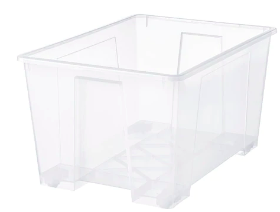

# Введение в docker 

Поговорим о том, что такое Docker и на каких принципах основана разработка Docker-приложений.

## Основные концепции

Докер — это открытая платформа для разработки, доставки и эксплуатации приложений, написан на Go. Проект [стартовал в 2008 году](https://ru.wikipedia.org/wiki/Docker) и начал бурное развитие в 2015, которое продолжается до сих пор.

Docker использует архитектуру клиент-сервер. Docker клиент общается с демоном Docker, который берет на себя тяжесть создания и запуска ваших контейнеров.
Оба, клиент и сервер могут работать на одной системе, также вы можете подключить клиент к удаленному демону docker.

Основные концепции

* **образы (image)** - это read-only шаблон. На базе образа создаются контейнеры, образ - это юнит сборки docker-а.
* **контейнеры (container)** могут быть созданы, запущены, остановлены, перенесены или удалены. Каждый контейнер изолирован и является платформой для *одного* приложения
* **регистр (registry)** - хранилище образов, см. [Docker Hub](https://hub.docker.com/)

Docker использует [union file system](https://en.wikipedia.org/wiki/UnionFS) для сочетания нескольких уровней (слоёв) в один образ.
Слой - это набор файлов, несколько слоёв докер-образа - это, по сути, операции с файловой системой по добавлению файлов. Посмотреть, какой объём файлов добавляет каждый слой к финальному образу, можно с помощью команды `docker history`.
Union file system позволяет файлам и директориями из разных файловых систем накладываться, т.е.один и тот же слой может быть использован разными контейнерами/

Важный принцип построения контейнеров: слои должны быть достаточно атомарными, но при этом слоёв не должно быть слишком много.

**Вопрос на понимание**: чем отличается образ от контейнера?

## Главный принцип докера

Главный принцип докера - "one function per container", т.е. в одном контейнере должно жить одно приложение. Почему это важно?

* горизонтальное масштабирование. Нужно больше инстансов nginx, а инстанс Postgres справляется? Добавляйте только nginx
* переиспользование приложений - используйте один и тот же инстанс Postgres для разных приложений
* траблшутинг в сложных проектах - проще понять, какая часть системы "тупит"
* патчи и апгрейд ОС
* проще откатывать
* изолирование и безопасность
* логирование и мониторинг

Но самое важное - это [политика рестартов docker](https://docs.docker.com/engine/reference/run/#restart-policies---restart) которая очень сильно облегчит оркестрацию ваших приложений.

## Критика Docker

Docker - технология, которая переживает бурный рост. Это выражается в том, что на [странице с командами Docker](https://docs.docker.com/engine/reference/commandline/docker/) огромное количество команд помечено "звёздочкой" - это экспериментальные команды.
Огромное количество таких команд как бы намекает нам, что технология находится на этапе бурного роста, которые сопровождается типичными проблемами - быстрое устаревание документации, отсутствие обратной совместимости между разными версиями докер-демона и т.д.

На эту тему можно почитать  на хабре ["Исповедь докер-хейтера"](https://habr.com/ru/post/467607/) - там приводится разумная критика докера с пруфлинками.

Вывод тут такой: для прода использовать с осторожностью, идеальная сфера для применения - разработка и эксперименты. Докер позволяет быстро развернуть требуемую инфраструктуру без больших трудозатрат.

Теперь, когда вы понимаете достоинства и ограничения докера - можно переходить к первому уроку про [команду docker run](./slides/docker_run.md)